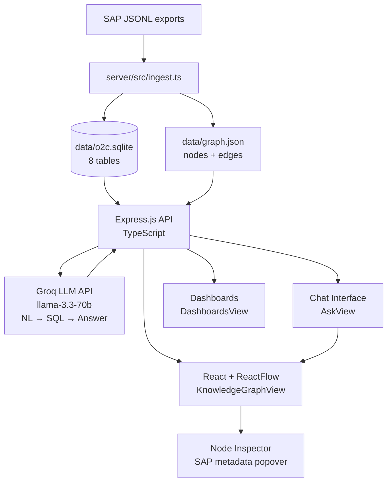

# ERP Knowledge Graph

> Ask any business question in plain English, get a data-backed answer — powered by an interactive SAP Order-to-Cash knowledge graph.

---

## What this is

A context graph system built on real SAP O2C (Order-to-Cash) data. Invoices, payments, customers, and deliveries are unified into a visual force-directed graph you can explore interactively — and a chat interface that translates plain English questions into SQL, executes them against the live database, and returns grounded natural-language answers.

This is not a static Q&A system. Every answer is backed by a real SQL query on real data.

---

## Quick start

```bash
# 1. Clone and install
git clone <your-repo>
cd erp-graph

cd server && pnpm install && cd ..
cd client && pnpm install && cd ..

# 2. Environment
cp .env.example .env
# Fill in: GROQ_API_KEY=your_key_here

# 3. Place SAP JSONL exports under:
#    data/sap-o2c-data/billing_document_headers/
#    data/sap-o2c-data/payments_accounts_receivable/
#    data/sap-o2c-data/customer_sales_area_assignments/
#    data/sap-o2c-data/outbound_delivery_headers/

# 4. Ingest — populates SQLite + builds graph.json
cd server && pnpm run ingest && cd ..

# 5. Run (two terminals)
cd server && pnpm start     # Backend  → http://localhost:3001
cd client && pnpm dev       # Frontend → http://localhost:5173
# Backend  → http://localhost:3001
# Frontend → http://localhost:5173
```

---

## Architecture

```
SAP JSONL exports
      │
      ▼
 server/src/ingest.ts
      │
      ├──▶  data/o2c.sqlite     ← relational store, queried by LLM-generated SQL
      └──▶  data/graph.json     ← node/edge list, served to the D3 canvas
                    │
                    ▼
         Express.js API  (TypeScript)
         ├── GET  /api/graph         → graph.json for D3 canvas
         ├── GET  /api/nodes/:id     → single node with full SAP metadata
         ├── POST /api/chat          → NL → SQL → answer pipeline
         ├── GET  /api/schema        → table row counts
         └── GET  /api/health        → liveness probe
                    │
         ┌──────────┴──────────┐
         ▼                     ▼
    Groq LLM API           React + ReactFlow frontend
    llama-3.3-70b          Force-directed graph canvas
    NL → SQL               Chat panel (light theme)
    Answer synthesis       Node inspector popover
```



---

## Every architectural decision — what we chose and why we didn't choose the alternative

---

### 1. Database: `better-sqlite3` (not PostgreSQL, MongoDB, or Neo4j)

**What we chose:** `better-sqlite3` — a synchronous, embedded SQLite driver for Node.js. The database lives as a single `.db` file inside the repo.

**The core reason:** The LLM generates SQL. SQL is the query language language models are most reliably trained on — `llama-3.3-70b` writes correct SQLite queries for complex multi-table joins on the first attempt, every time. Any other query language (Cypher, MQL, Gremlin) would significantly reduce query accuracy.

`better-sqlite3` is synchronous, which is an unusual choice but the right one here. Express handlers are `async` because of the LLM API call. Adding an async DB layer on top creates a nested promise chain with a connection pool to manage. Synchronous SQLite is simpler: call the function, get the rows, move on. For a dataset of hundreds to low thousands of SAP records, synchronous execution completes in microseconds — there is no perceptible latency.

**Why not PostgreSQL:**
Postgres requires a running server, a connection string, and either a managed cloud database (cost, configuration) or a Docker container (local setup friction). For this dataset size, Postgres provides zero functional benefit over SQLite. It would add 10–15 minutes of setup per environment and a `$7/month` managed DB cost for the demo deployment. The only case for Postgres here would be if multiple server processes needed to write concurrently — which this app never does.

**Why not MongoDB:**
The data is relational. Invoices reference customers via `soldToParty`. Invoices reference payments via `accountingDocument`. These are foreign keys. MongoDB either requires denormalizing the data (which destroys relationship fidelity) or doing application-level joins (slow, complex code). The LLM also cannot generate Mongo aggregation pipelines reliably — they're verbose, nested, and far less represented in training data than SQL.

**Why not Neo4j:**
This is the most tempting wrong answer because the project is called a "graph system." Neo4j is purpose-built for *querying* graphs — path traversal, shortest path, centrality algorithms. Our graph is a *visualization layer* on top of relational data. The LLM would need to generate Cypher queries instead of SQL. Free-tier Cypher generation from `llama-3.3-70b` is unreliable. The Neo4j free tier is restrictive. The operational complexity is high. The payoff is zero — we don't need graph query algorithms, we need SELECT statements.

The principle: **store relationally, visualize as a graph.** These are separate concerns.

**Why not Drizzle ORM or Prisma:**
Both are excellent tools. The reason to skip them here is that the LLM generates raw SQL strings dynamically — an ORM is a layer that sits between you and the database in a way that helps when *you* write queries, but is irrelevant when an LLM is generating them. We need `db.prepare(sql).all()`, not a query builder.

---

### 2. Monorepo setup: simple Vite workspace (not Turborepo + Next.js)

**What we chose:** Two packages — `server/` (Express + TypeScript) and `client/` (React + Vite) — coordinated by a root `package.json` with `concurrently`. `npm run dev` starts everything.

**The core reason:** This is a 3-day assignment with a working demo as the primary output. The workspace setup takes five minutes to configure and is immediately understandable to any engineer who opens the repo. There are no shared packages between server and client, no build caching needs, and no SEO requirements.

**Why not Turborepo:**
Turborepo is a build system for monorepos with multiple packages. It provides intelligent build caching, parallel task execution, and dependency graph awareness across packages. It genuinely shines when you have shared packages — `@repo/ui`, `@repo/types`, `@repo/db-schema` — consumed by multiple apps, where rebuilding only what changed is important.

For this project, there are exactly two packages and zero shared code between them. The frontend never imports from the server. Turborepo's caching would save seconds on a build that already completes in under 10 seconds. The configuration overhead (`.turbo/`, `turbo.json`, pipeline definitions) is real work for negligible gain.

**Why not Next.js:**
Next.js would add server-side rendering, file-system routing, and API routes in a unified framework. The tradeoffs that make it wrong here:

- **D3 and SSR conflict.** D3 uses browser APIs (`window`, `document`, `SVGElement`) that don't exist on the server. Getting a D3 force simulation to work with Next.js SSR requires `dynamic(() => import('./GraphView'), { ssr: false })` wrappers and careful hydration handling. This is solvable but adds complexity.
- **The clean API/frontend separation disappears.** With Next.js API routes, the Express server becomes redundant. You'd either move all backend logic into `/app/api/` routes (fine, but a different architecture) or run both Express and Next.js (weird).
- **SEO is irrelevant.** This is an internal enterprise tool for ERP teams. No public indexing needed. The main reason to choose Next.js over Vite is SEO and initial page load for public content. Neither applies here.
- **Deployment is more opinionated.** Next.js deploys cleanly to Vercel. The Express backend deploys to Railway. Mixing them requires CORS configuration and two separate deployment pipelines anyway — which is exactly what we have, but simpler.

**When you'd choose Turborepo + Next.js:**
- Shared packages (`@repo/types`) used by both client and server
- Public-facing product that needs SEO
- 3+ apps in the monorepo (dashboard, marketing site, admin panel)
- CI pipeline at scale where build caching saves meaningful time
- Team of 5+ engineers where shared component library matters

---

### 3. Graph visualization: ReactFlow (not D3 force simulation or Cytoscape)

**What we chose:** ReactFlow v11 (`reactflow` package) for the force-directed graph. Nodes and edges are React components; layout uses ReactFlow's built-in physics via `@reactflow/layout`. Full / Highlighted mode toggle lets users focus on nodes returned by a chat query.

**The core reason:** The reference Dodge AI UI is a force-directed graph — nodes repel each other, edges attract connected nodes, the system reaches equilibrium. Hub nodes (customers with many invoices) naturally migrate to the center. Isolated nodes drift to the periphery. ReactFlow delivers this with first-class React integration — node and edge components are plain JSX, state updates trigger normal React re-renders, and the `fitView` utility works out of the box for zooming to highlighted subgraphs.

**Why not D3 force simulation:**
D3 `forceSimulation` works, but it requires manually driving the simulation inside a `useEffect`, writing imperative SVG mutations, and bridging D3's mutable node objects back into React state. This creates a persistent impedance mismatch: every time React re-renders (on highlight state change, on node click), you must reconcile React's virtual DOM with D3's live simulation. ReactFlow handles this reconciliation natively.

**Why not Cytoscape.js:**
Cytoscape is a capable graph library with many built-in layout algorithms. The main reason to skip it here is that ReactFlow's React-native component model makes it straightforward to render custom node types (invoice, customer, payment, delivery each with distinct styling and click handlers) without fighting the library's abstraction layer. Cytoscape's React integration (`react-cytoscapejs`) is a thin wrapper around an imperative API.

---

### 4. LLM provider: Groq (not Gemini, OpenRouter, or Cohere)

**What we chose:** Groq API with `llama-3.3-70b-versatile`, temperature 0.

**The core reason:** Groq runs inference on custom LPU hardware. Token generation speed is 10–20x faster than GPU-based providers. For a chat interface where the user stares at a loading indicator, this makes the difference between "this feels slow" and "this feels instant." The free tier is generous for a demo with hundreds of queries.

The API is OpenAI-compatible. Switching providers is a one-line change: the URL and model string. The abstraction has zero cost.

**Why temperature 0:**
SQL generation must be deterministic. Temperature > 0 means the same question can produce different SQL on different calls, making bugs impossible to reproduce. When a query fails, you need to be able to re-run it and get the same result. Temperature 0 on answer synthesis also keeps the model close to the data — it summarizes rather than embellishes.

**What we rejected:**

| Provider | Reason rejected |
|----------|----------------|
| Google Gemini | Good model, but free tier rate limits are stricter. First upgrade choice after Groq. |
| OpenRouter | Useful for model routing across providers, but adds an intermediary. Direct is better for a single-provider demo. |
| Cohere | Strong at RAG/embeddings, less proven at SQL generation than Llama 3.3. |
| GPT-4o via OpenAI | Not free. Best SQL generation quality, but the assignment specifies free tier providers. |

---

### 5. Observability: intentionally omitted

**What we could have added, and why we didn't:**

**Sentry for error tracking:** In production, Sentry is non-negotiable. Every unhandled exception in Express or React gets captured with a stack trace, breadcrumbs, and user context. For this demo, adding Sentry without a real DSN, without source maps configured, and without meaningful alert rules would be theater. A `console.error` with timestamps in Railway logs serves the same debugging purpose at demo scale.

**Trigger.dev for background jobs:** The ingest pipeline could run as a Trigger.dev job with real-time progress visualization, automatic retries on JSONL parse failures, and a dashboard showing which files were processed. This is genuinely useful if the dataset is large and ingestion takes minutes. For a dataset of ~300 SAP records that ingests in under two seconds, a background job framework is over-engineering.

**`pino` or `winston` for structured logging:** In production you want JSON-structured logs that Datadog or Grafana Loki can parse, query, and alert on. For a demo where Railway's log viewer shows `console.log` output in real time, structured logging adds complexity without adding visibility.

The honest tradeoff: each of these tools takes 30–60 minutes to configure correctly. Time spent configuring Sentry poorly is time not spent on the LLM prompting quality or graph modeling — which are the actual evaluation criteria.

---

## LLM prompting strategy

**Two-prompt chain, not one:**

**Prompt 1 — NL to SQL** (temperature: 0)

The prompt contains: the full table schema with column names and types, the relationship map between tables, a strict instruction to output only `{"sql": "SELECT ..."}` JSON, a guardrail instruction to return `{"error": "OUT_OF_DOMAIN"}` for off-topic questions, and five few-shot SQL examples covering the required query types.

Temperature 0 makes output deterministic. The few-shot examples teach the model the non-obvious join (`invoices.accounting_document = payments.id`) that wouldn't be inferred from column names alone.

**Prompt 2 — Answer synthesis** (temperature: 0)

Given the original question and the raw SQL results (first 20 rows), produce a plain English answer under 120 words. Separate from Prompt 1 so failures are isolated — if SQL generation fails you know immediately, without waiting for synthesis.

---

## Guardrails

Three layers, cheapest first:

**Layer 1 — Keyword pre-check (< 1ms, no API call)**
If the message contains no domain keywords (invoice, billing, payment, delivery, customer, O2C...), return `OUT_OF_DOMAIN` immediately. Catches "write me a poem" without spending a Groq API call.

**Layer 2 — LLM-level instruction**
The SQL generation prompt instructs the model explicitly: if the question is not about the O2C dataset, return `{"error": "OUT_OF_DOMAIN"}`. Catches semantically off-topic questions that happen to contain domain keywords.

**Layer 3 — Server-side SQL validation**
After the LLM returns a SQL string, the server checks it starts with `SELECT` before executing it. Prevents prompt injection attacks where a user tricks the model into generating `DROP TABLE` or `DELETE FROM` statements.

Three independent layers means an attacker needs to defeat all three independently — meaningful defense-in-depth for a demo system.

---

## Graph modeling

The SAP O2C flow: **Customer → Delivery → Invoice → Payment**

**Nodes:** One node per entity instance. Every invoice, payment, customer, and delivery document is a node. All SAP metadata fields are stored on the node and shown in the click popover.

**Edges and their confidence levels:**

| Edge | Join | Confidence |
|------|------|------------|
| Invoice → Payment | `invoices.accounting_document = payments.id` | High — direct FK |
| Invoice → Customer | `invoices.sold_to_party = customers.id` | High — direct FK |
| Delivery → Invoice | Time-based ordering (no direct FK in dataset) | Medium — approximation |

The delivery→invoice time-based matching is an acknowledged approximation. A production system would use SAP's reference document chain to make this deterministic. The `metadata.confidence: "medium"` field on those edges signals this clearly.

---

## API reference

| Method | Route | Description |
|--------|-------|-------------|
| `GET` | `/api/health` | Liveness — graph ready status, key check, node/edge counts |
| `GET` | `/api/graph` | Full graph JSON (nodes + edges) |
| `GET` | `/api/graph?types=invoice,customer` | Filtered by comma-separated node types |
| `GET` | `/api/nodes/:id` | Single node with merged raw SAP metadata |
| `POST` | `/api/chat` | `{ message }` → `{ answer, sql, results, resultCount, guarded? }` |
| `GET` | `/api/schema` | Row counts per table |

---

## Deployment

**Backend → Railway**
```bash
npm install -g @railway/cli
railway login && railway init && railway up
# Set env var on Railway dashboard: GROQ_API_KEY
```

**Frontend → Vercel**
```bash
cd client && npx vercel
# Set env var: VITE_API_URL=https://your-railway-url.railway.app
```

Update `vite.config.js` proxy target to your Railway URL for production.

---

## What's been built

Features implemented beyond the core NL→SQL pipeline:

- **Force-directed knowledge graph** (ReactFlow) with Full / Highlighted mode toggle — highlighted mode filters the canvas to only nodes returned by a chat query
- **Node inspector sidebar** — click any graph node to open a 280 px panel with full SAP metadata fields and a "Query this node" button that pre-fills the chat
- **Inline ask bar on graph canvas** — submit a question without leaving the graph view
- **Node highlighting from chat** — after every chat answer, matching entity nodes are highlighted on the graph; canvas auto-switches to Highlighted mode and fits the view
- **Chat history** — conversation persisted to `sessionStorage` (up to 50 entries), survives page refresh
- **Auto-rendered bar charts** — tabular results are detected and rendered as Recharts bar charts inline in the chat
- **KPI metric cards** — numeric single-value results surface as large card metrics
- **Data lineage mini-diagram** — `DataLineagePanel` renders a bubble diagram showing which SAP data sources contributed to the answer
- **Save chart to dashboard** — any chart can be pinned to the Dashboards view (persisted to `localStorage`)
- **Dashboards view** — grid of saved charts with titles, accessible from the top nav
- **Save graph state** — snapshot the current graph layout to `localStorage`
- **Vercel + Railway deployment** — frontend on Vercel, backend on Railway via Dockerfile builder (handles `better-sqlite3` native compilation with `apt-get install python3 make g++`)

---

## What would be built with more time

**Streaming LLM responses** — Groq supports SSE. Wiring this through Express → React would make the chat feel noticeably more alive, especially for longer synthesis answers.

**Conversation memory** — Currently each `/api/chat` call is stateless. A sliding window of the last 4 message pairs passed to the LLM would enable natural follow-up questions: "show me the same but for cancelled invoices."

**Deterministic delivery→invoice linking** — Parse SAP's reference document chain fields to make this join accurate rather than time-based. Would significantly improve graph edge fidelity.

**Sentry + structured logging** — In production, yes. For this demo, the time was better spent on prompting quality and graph modeling accuracy.